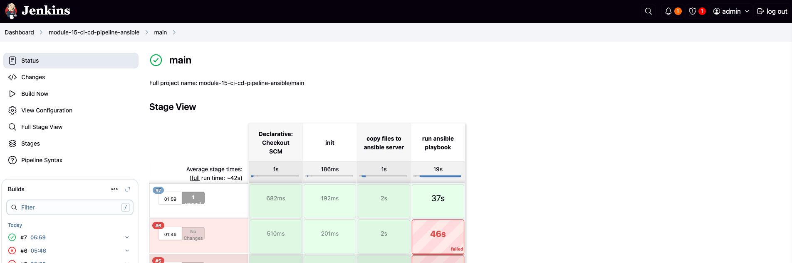

# Ansible-Driven CI/CD Pipeline for Docker Compose on AWS EC2

This project demonstrates a CI/CD pipeline using Jenkins and Ansible to deploy a Java Maven application within Docker containers on Amazon EC2 instances. It uses a dedicated Ansible server and leverages the AWS inventory plugin for dynamic EC2 discovery.

## Table of Contents

- [Project Overview](#project-overview)
- [Implementation Steps](#implementation-steps)
- [Key Configuration](#key-configuration)
- [Technologies Used](#technologies-used)
- [Pipeline Details](#pipeline-details)
- [Ansible Playbook Details](#ansible-playbook-details)
- [Screenshots](#screenshots)

## Project Overview

This project automates the deployment of a containerized Java application stack on AWS EC2, handling Docker installation, user management, and application deployment via Docker Compose. _Ansible, using the AWS inventory plugin, dynamically discovers and manages the target EC2 instances._ The pipeline utilizes Jenkins for orchestration and includes these key phases:

1.  Loads custom functions from `script.groovy`.
2.  Copies files to the Ansible server.
3.  Executes the Ansible playbook to deploy the application.

## Implementation Steps

The `Jenkinsfile` defines the CI/CD pipeline, which includes the following key steps:

1.  **Connect to the Ansible server:** Establishes a connection to the dedicated Ansible control node.

2.  **Prepare the Ansible server:** Copies Ansible playbooks, configuration files, and SSH keys to the Ansible server and installs necessary dependencies (Ansible, Python3, Boto3).

3.  **Execute the Ansible playbook:** Configures the EC2 instances, installs Docker and Docker Compose, creates a user and adds them to the Docker group, and deploys the application's containers using `docker-compose.yaml`.

## Key Configuration

- **`Jenkinsfile`**: Defines the CI/CD pipeline.
  - `ANSIBLE_SERVER`: Ansible control node IP.
  - `VERSION`: Application version.
- **`script.groovy`**: Contains functions for copying files and executing the playbook.
- **`ansible/deploy-docker-ec2.yaml`**: Ansible playbook for EC2 configuration and deployment.
- **`ansible/inventory_aws_ec2.yaml`**: Defines the dynamic inventory plugin for AWS EC2.
- **`docker-compose.yaml`**: Defines the application's Docker containers.
- **`prepare-ansible-server.sh`**: Installs Ansible and dependencies on the control node.

## Technologies Used

- **Ansible:** Configuration management and automation.
- **Jenkins:** CI/CD pipeline automation.
- **Docker:** Containerization.
- **Docker Compose:** Multi-container application definition.
- **EC2:** Virtual servers in the cloud.
- **Boto3:** AWS SDK for Python.

## Pipeline Details

The `Jenkinsfile` orchestrates:

1.  **Initialization:** Loads `script.groovy`.
2.  **Copy Files to Ansible Server:** Copies playbooks, `docker-compose.yaml`, and SSH keys to the Ansible control node.
3.  **Run Ansible Playbook:** Executes `prepare-ansible-server.sh` and the `deploy-docker-ec2.yaml` playbook.

## Ansible Playbook Details

The Ansible playbook:

1.  Installs Docker and Docker Compose.
2.  Creates a user and adds them to the Docker group.
3.  Deploys containers defined in `docker-compose.yaml`.

## Screenshots

**Jenkins Pipeline Overview:**

